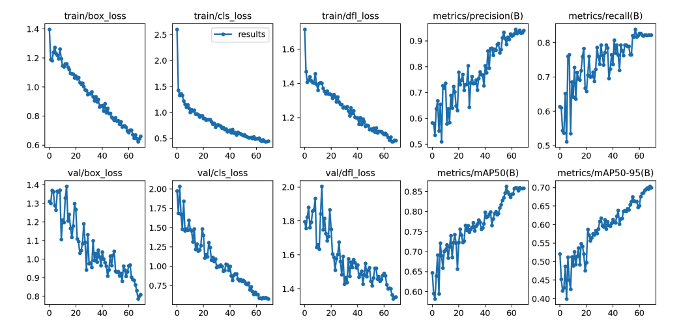

##### Download

+ [Paper](https://ieeexplore.ieee.org/abstract/document/10374650)

---

##### Abstract

This paper explores a YOLOv8-based approach for detecting objects in real-time video streams. By leveraging custom datasets, the model achieves higher accuracy and speed, reaching a mAP50 of 0.864 and mAP50-95 of 0.758. The study emphasizes the importance of custom training data for precision, making YOLOv8 a viable solution for real-world applications like robotics, surveillance, and autonomous vehicles.

---

##### Figure: YOLOv8 Model Structure



---

##### Citation

Ahmad, T., Maaz, A., Mahmood, D., Abideen, Z., Arshad, U., & Ali, R.H. 2023. "The YOLOv8 Edge: Harnessing Custom Datasets for Superior Real-time Detection." *Proc. of 18th Int. Conf. on Emerging Technologies*. IEEE, Peshawar, Pakistan. DOI: [Link to DOI]

```BibTeX
@inproceedings{YOLOv8Edge,
author = {Ahmad, T., Maaz, A., Mahmood, D., Abideen, Z., Arshad, U., Ali, R.H.},
title = {The YOLOv8 Edge: Harnessing Custom Datasets for Superior Real-time Detection},
booktitle = {Proc. of 18th Int. Conf. on Emerging Technologies},
year = {2023},
location = {Peshawar, Pakistan},
publisher = {IEEE},
doi = {Link to DOI}
}
