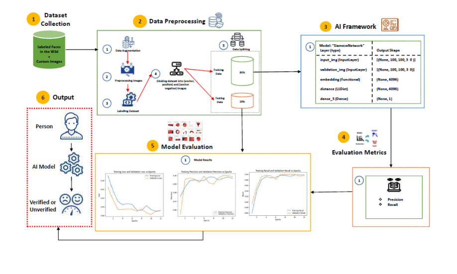

##### Download

+ [Paper](https://scholar.google.ca/citations?view_op=view_citation&hl=en&user=P5AoWNcAAAAJ&authuser=1&citation_for_view=P5AoWNcAAAAJ:u-x6o8ySG0sC)

---

##### Abstract

The study delves into the optimization of hyperparameters to enhance the accuracy of Siamese neural networks in facial recognition. Experiments demonstrate the impact of optimizers, loss functions, and diverse datasets on model performance, achieving notable accuracy improvements. Key findings highlight the importance of dataset variability and hyperparameter selection in boosting model precision for real-world applications.

---

##### Figure: Siamese Neural Network Architecture



---

##### Citation

Maaz, A., Arshad, U., Ahmad, T., & Abbas, S. 2024. "Influencing Factors in Facial Recognition and Verification: A Siamese Neural Network Hyperparameter Study." *Proc. of 2024 Int. Conf. on Engineering & Computing Technologies*. IEEE, Islamabad, Pakistan. DOI: [Link to DOI]

```BibTeX
@inproceedings{SiameseNNStudy,
author = {Maaz, A., Arshad, U., Ahmad, T., Abbas, S.},
title = {Influencing Factors in Facial Recognition and Verification: A Siamese Neural Network Hyperparameter Study},
booktitle = {Proc. of 2024 Int. Conf. on Engineering & Computing Technologies},
year = {2024},
location = {Islamabad, Pakistan},
publisher = {IEEE},
doi = {Link to DOI}
}