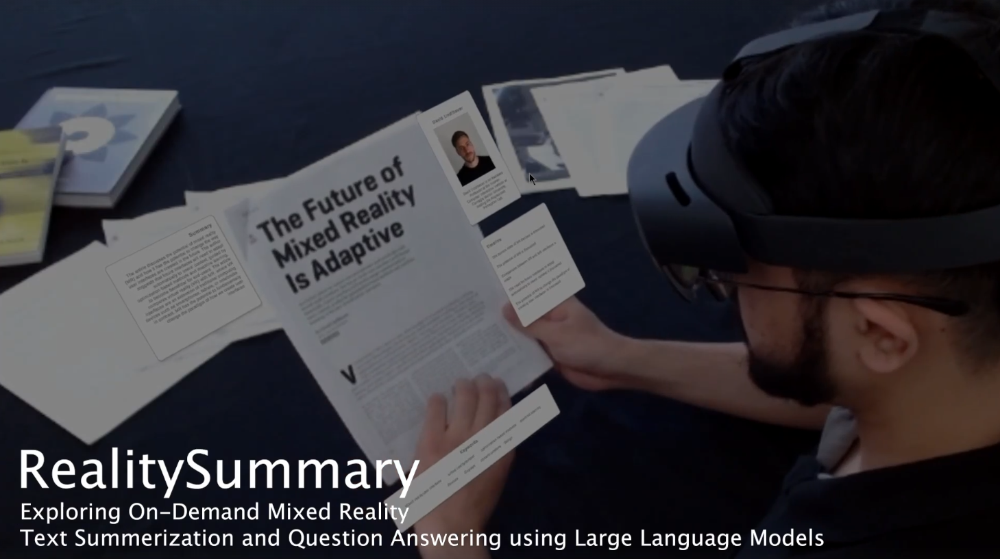

##### Abstract

RealitySummary is a mixed reality reading assistant that integrates OCR and GPT-based large language models for on-demand document summarization and question answering. Through three design iterations and corresponding user studies, the system showcases the potential of combining MR and AI for enhanced reading experiences across diverse real-world contexts.

---

##### Figure: RealitySummary System Architecture



---

##### Citation

"RealitySummary: Exploring On-Demand Mixed Reality Text Summarization and Question Answering using Large Language Models." *Proceedings of CHI'25*. ACM, New York, NY, USA. DOI: [Link to DOI]

```BibTeX
@inproceedings{RealitySummary_CHI25,
title = {RealitySummary: Exploring On-Demand Mixed Reality Text Summarization and Question Answering using Large Language Models},
booktitle = {Proceedings of CHI'25},
year = {2025},
publisher = {ACM},
doi = {Link to DOI}
}
